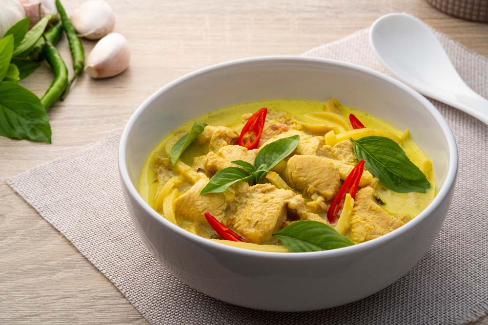

# แกงเขียวหวานไก่ (Thai Green Curry Chicken)

  <b>เมนูอาหารไทยยอดนิยม รสเข้มข้น หอมกะทิ เผ็ดนิด ๆ กินกับข้าวสวยร้อน ๆ คือที่สุด</b>

  
  
  

---

## 🧾 ส่วนประกอบ

| 🥦 วัตถุดิบ               | 📏 ปริมาณ |
| :------------------------ | :-------: |
| หัวกะทิ                   |   90 มล.  |
| พริกแกงเขียวหวาน          |  45 กรัม  |
| อกไก่                     |  150 กรัม |
| หางกะทิ (หัวกะทิละลายน้ำ) |  150 มล.  |
| น้ำปลา                    |   5 กรัม  |
| รสดี รสไก่                |   1 กรัม  |
| ใบมะกรูด                  |    6 ใบ   |
| มะเขือเปราะ               |  300 กรัม |
| มะเขือพวง                 |  30 กรัม  |
| พริกชี้ฟ้าแดง             |  15 กรัม  |
| ใบโหระพา                  |  10 กรัม  |

---

## 👨‍🍳 วิธีทำ

1. ตั้งกระทะ ใส่ **หัวกะทิ** เคี่ยวจนเริ่มเดือด
2. ใส่ **พริกแกงเขียวหวาน** ลงไป ผัดจนแตกมันและหอม
3. ใส่ **อกไก่** ผัดให้เข้ากับพริกแกงจนเนื้อเริ่มสุก
4. เติม **หางกะทิ** ลงไป รอจนเดือดอีกครั้ง
5. ปรุงรสด้วย **น้ำปลา + น้ำตาลปี๊บ + รสดี** คนให้ละลาย
6. ใส่ **ใบมะกรูด + มะเขือเปราะ + มะเขือพวง** ต้มจนผักสุก
7. ปิดไฟ ใส่ **พริกชี้ฟ้าแดง + ใบโหระพา** คนให้เข้ากัน

---

## 📊 ตารางโภชนาการ (โดยประมาณ / ต่อ 1 ที่)

| 🧪 สารอาหาร  | 📏 ปริมาณ |
| :----------- | :-------: |
| พลังงาน      |  420 kcal |
| โปรตีน       |    28 g   |
| ไขมัน        |    30 g   |
| คาร์โบไฮเดรต |    12 g   |
| น้ำตาล       |    6 g    |
| โซเดียม      |   950 mg  |

> ⚠️ ค่าทางโภชนาการเป็นค่าประมาณ อาจเปลี่ยนแปลงตามวัตถุดิบที่ใช้

---

## 🔥 Tips

* ผัดพริกแกงกับหัวกะทิให้ “แตกมัน” จะได้กลิ่นหอมและรสเข้มข้น
* ถ้าชอบมันน้อย ลดหัวกะทิ เพิ่มหางกะทิแทนได้
* ใส่ใบโหระพาตอนสุดท้าย จะหอมสดใหม่ที่สุด

---

## 🍽️ การเสิร์ฟ

เสิร์ฟร้อน ๆ พร้อม **ข้าวสวย** หรือ **ขนมจีน** ก็เข้ากันสุด ๆ

---

## 📦 Info

| รายการ            | ค่า      |
| ----------------- | -------- |
| ⏱️ เวลา           | ~30 นาที |
| 🍽️ จำนวนเสิร์ฟ   | 1–2 ที่  |
| 🌶️ ระดับความเผ็ด | ปานกลาง  |

